# Entity Relationship Diagram - SiSantri

## ER Diagram (Mermaid Format)

```mermaid
erDiagram
    USERS ||--o{ PRESENSI : "mencatat"
    USERS ||--o{ PENGUMUMAN : "membuat"
    USERS ||--o{ JADWAL : "mengatur"
    USERS ||--o{ NOTIFIKASI : "menerima"
    USERS ||--o{ POINT_TRANSACTIONS : "memiliki"
    USERS ||--o{ USER_ACHIEVEMENTS : "meraih"
    USERS ||--o{ AUDIT_LOG : "tercatat_di"
    USERS ||--o{ EVENT_PARTICIPANTS : "berpartisipasi"
    
    JADWAL ||--o{ EVENT_PARTICIPANTS : "memiliki"
    JADWAL ||--o{ EVENT_REMINDERS : "memiliki"
    
    PENGUMUMAN ||--o{ ANNOUNCEMENT_READS : "dibaca_oleh"
    
    ACHIEVEMENTS ||--o{ USER_ACHIEVEMENTS : "diraih"
    
    LEADERBOARD }o--|| USERS : "menampilkan"
    
    REPORTS }o--|| USERS : "dibuat_oleh"
    REPORTS }o--|| PRESENSI : "berdasarkan"

    USERS {
        string uid PK "Primary Key (Firebase UID)"
        string email UK "Email unik"
        string nama "Nama lengkap"
        string role "santri, dewan_guru, admin"
        string nisn "Nomor Induk Siswa Nasional"
        string nip "Nomor Induk Pegawai (untuk guru)"
        string kelas "Kelas santri"
        string foto_url "URL foto profil"
        string rfid_tag_id UK "ID tag RFID unik"
        string no_telepon "Nomor telepon"
        string alamat "Alamat lengkap"
        datetime tanggal_lahir "Tanggal lahir"
        string jenis_kelamin "L/P"
        int total_poin "Total poin gamifikasi"
        int level "Level pengguna"
        boolean is_active "Status aktif"
        datetime created_at "Waktu dibuat"
        datetime updated_at "Waktu diupdate"
        datetime deleted_at "Waktu dihapus (soft delete)"
        json preferences "Preferensi pengguna"
    }

    PRESENSI {
        string id PK "Primary Key"
        string user_id FK "Foreign Key ke USERS"
        datetime tanggal "Tanggal presensi"
        time waktu_masuk "Waktu check-in"
        time waktu_keluar "Waktu check-out"
        string status "hadir, terlambat, izin, sakit, alpha"
        string metode "rfid, manual, qr_code"
        string keterangan "Keterangan tambahan"
        string verified_by FK "ID admin/guru yang verifikasi"
        boolean is_verified "Status verifikasi"
        string lokasi "Lokasi presensi"
        json metadata "Data tambahan"
        datetime created_at "Waktu dibuat"
        datetime updated_at "Waktu diupdate"
    }

    PENGUMUMAN {
        string id PK "Primary Key"
        string judul "Judul pengumuman"
        text konten "Isi pengumuman"
        string kategori "umum, penting, mendesak"
        string prioritas "low, medium, high"
        string created_by FK "Foreign Key ke USERS"
        string target_audience "all, santri, dewan_guru, kelas_tertentu"
        json target_roles "Array role target"
        json target_classes "Array kelas target"
        string lampiran_url "URL file lampiran"
        datetime tanggal_mulai "Tanggal mulai ditampilkan"
        datetime tanggal_berakhir "Tanggal berakhir"
        boolean is_published "Status publikasi"
        boolean is_pinned "Status pin"
        int view_count "Jumlah yang melihat"
        datetime created_at "Waktu dibuat"
        datetime updated_at "Waktu diupdate"
    }

    ANNOUNCEMENT_READS {
        string id PK "Primary Key"
        string announcement_id FK "Foreign Key ke PENGUMUMAN"
        string user_id FK "Foreign Key ke USERS"
        datetime read_at "Waktu dibaca"
        boolean is_read "Status sudah dibaca"
    }

    JADWAL {
        string id PK "Primary Key"
        string nama_kegiatan "Nama event/kegiatan"
        text deskripsi "Deskripsi lengkap"
        string jenis "pembelajaran, ibadah, ekstrakurikuler, acara_khusus"
        datetime tanggal_mulai "Tanggal & waktu mulai"
        datetime tanggal_selesai "Tanggal & waktu selesai"
        string lokasi "Lokasi kegiatan"
        string created_by FK "Foreign Key ke USERS"
        string target_peserta "all, santri, dewan_guru, manual"
        json target_roles "Array role peserta"
        json target_classes "Array kelas peserta"
        int kapasitas "Kapasitas maksimal peserta"
        int current_participants "Jumlah peserta saat ini"
        boolean is_mandatory "Apakah wajib"
        string status "scheduled, ongoing, completed, cancelled"
        boolean enable_reminders "Aktifkan reminder"
        json reminder_schedule "Jadwal reminder (24h, 2h, 30m)"
        string calendar_sync_id "ID untuk sinkronisasi kalender eksternal"
        datetime registration_deadline "Batas waktu pendaftaran"
        datetime created_at "Waktu dibuat"
        datetime updated_at "Waktu diupdate"
    }

    EVENT_PARTICIPANTS {
        string id PK "Primary Key"
        string event_id FK "Foreign Key ke JADWAL"
        string user_id FK "Foreign Key ke USERS"
        string status "registered, confirmed, attended, absent, cancelled"
        datetime registered_at "Waktu mendaftar"
        datetime confirmed_at "Waktu konfirmasi"
        string notes "Catatan partisipasi"
    }

    EVENT_REMINDERS {
        string id PK "Primary Key"
        string event_id FK "Foreign Key ke JADWAL"
        string user_id FK "Foreign Key ke USERS"
        string reminder_type "24h, 2h, 30m"
        datetime scheduled_time "Waktu terjadwal"
        boolean is_sent "Status terkirim"
        datetime sent_at "Waktu terkirim"
    }

    NOTIFIKASI {
        string id PK "Primary Key"
        string user_id FK "Foreign Key ke USERS"
        string judul "Judul notifikasi"
        text pesan "Isi pesan"
        string tipe "presensi, pengumuman, jadwal, gamifikasi, sistem"
        string prioritas "low, medium, high"
        json data "Data tambahan JSON"
        string action_type "navigate, open_url, dismiss"
        string action_payload "Data untuk action"
        boolean is_read "Status sudah dibaca"
        datetime read_at "Waktu dibaca"
        string channel "push, in_app, email"
        string source_id "ID sumber notifikasi"
        string source_type "announcement, event, attendance"
        datetime created_at "Waktu dibuat"
        datetime scheduled_at "Waktu dijadwalkan"
        datetime sent_at "Waktu dikirim"
    }

    POINT_TRANSACTIONS {
        string id PK "Primary Key"
        string user_id FK "Foreign Key ke USERS"
        string transaction_type "attendance, achievement, event, penalty"
        int points "Jumlah poin (+/-)"
        string event_type "hadir_tepat_waktu, terlambat, perfect_week, dll"
        string description "Deskripsi transaksi"
        string reference_id "ID referensi (presensi_id, event_id, dll)"
        string reference_type "presensi, event, achievement"
        datetime created_at "Waktu transaksi"
        json metadata "Data tambahan"
    }

    ACHIEVEMENTS {
        string id PK "Primary Key"
        string nama "Nama achievement"
        text deskripsi "Deskripsi achievement"
        string kategori "attendance, streak, participation, special"
        string icon_url "URL icon achievement"
        json criteria "Kriteria untuk unlock"
        int points_reward "Reward poin"
        string rarity "common, rare, epic, legendary"
        boolean is_active "Status aktif"
        datetime created_at "Waktu dibuat"
    }

    USER_ACHIEVEMENTS {
        string id PK "Primary Key"
        string user_id FK "Foreign Key ke USERS"
        string achievement_id FK "Foreign Key ke ACHIEVEMENTS"
        datetime unlocked_at "Waktu unlock"
        int progress "Progress pencapaian"
        boolean is_completed "Status selesai"
        datetime completed_at "Waktu selesai"
    }

    LEADERBOARD {
        string id PK "Primary Key"
        string user_id FK "Foreign Key ke USERS"
        string period "daily, weekly, monthly, all_time"
        int rank "Peringkat"
        int total_points "Total poin"
        datetime period_start "Awal periode"
        datetime period_end "Akhir periode"
        datetime updated_at "Waktu update"
    }

    REPORTS {
        string id PK "Primary Key"
        string nama_laporan "Nama laporan"
        string tipe "attendance, statistics, custom"
        string format "pdf, excel"
        datetime tanggal_mulai "Tanggal mulai data"
        datetime tanggal_selesai "Tanggal selesai data"
        json filters "Filter yang digunakan"
        string generated_by FK "Foreign Key ke USERS"
        string file_url "URL file laporan"
        string status "pending, processing, completed, failed"
        json schedule "Jadwal otomatis (jika ada)"
        json recipients "Penerima laporan"
        datetime created_at "Waktu dibuat"
        datetime completed_at "Waktu selesai"
    }

    AUDIT_LOG {
        string id PK "Primary Key"
        string user_id FK "Foreign Key ke USERS"
        string action "create, update, delete, login, logout"
        string entity_type "user, presensi, pengumuman, jadwal"
        string entity_id "ID entitas yang diubah"
        json old_data "Data lama"
        json new_data "Data baru"
        string ip_address "IP address"
        string user_agent "User agent"
        datetime created_at "Waktu action"
    }
```

## Deskripsi Relasi

### 1. USERS (Entitas Utama)
- **One-to-Many** dengan PRESENSI: Satu pengguna dapat memiliki banyak catatan presensi
- **One-to-Many** dengan PENGUMUMAN: Satu admin/guru dapat membuat banyak pengumuman
- **One-to-Many** dengan JADWAL: Satu admin/guru dapat mengatur banyak jadwal
- **One-to-Many** dengan NOTIFIKASI: Satu pengguna dapat menerima banyak notifikasi
- **One-to-Many** dengan POINT_TRANSACTIONS: Satu pengguna dapat memiliki banyak transaksi poin
- **One-to-Many** dengan USER_ACHIEVEMENTS: Satu pengguna dapat meraih banyak achievement
- **One-to-Many** dengan EVENT_PARTICIPANTS: Satu pengguna dapat berpartisipasi di banyak event
- **One-to-Many** dengan AUDIT_LOG: Aktivitas satu pengguna tercatat di banyak log

### 2. JADWAL (Event/Kegiatan)
- **One-to-Many** dengan EVENT_PARTICIPANTS: Satu event dapat memiliki banyak peserta
- **One-to-Many** dengan EVENT_REMINDERS: Satu event dapat memiliki banyak reminder untuk berbagai peserta

### 3. PENGUMUMAN
- **One-to-Many** dengan ANNOUNCEMENT_READS: Satu pengumuman dapat dibaca oleh banyak pengguna

### 4. ACHIEVEMENTS
- **One-to-Many** dengan USER_ACHIEVEMENTS: Satu achievement dapat diraih oleh banyak pengguna

### 5. LEADERBOARD
- **Many-to-One** dengan USERS: Banyak entry leaderboard terkait dengan users (untuk periode berbeda)

### 6. REPORTS
- **Many-to-One** dengan USERS: Laporan dibuat oleh pengguna
- **Many-to-One** dengan PRESENSI: Laporan berdasarkan data presensi

## Kardinalitas

- **1:N** (One-to-Many): Ditandai dengan `||--o{`
- **N:1** (Many-to-One): Ditandai dengan `}o--||`
- **1:1** (One-to-One): Ditandai dengan `||--||`

## Primary Keys & Foreign Keys

- **PK**: Primary Key (kunci utama setiap tabel)
- **FK**: Foreign Key (kunci yang mereferensikan tabel lain)
- **UK**: Unique Key (nilai harus unik)

## Catatan Implementasi

1. **Soft Delete**: Tabel USERS menggunakan `deleted_at` untuk soft delete
2. **Timestamps**: Semua tabel memiliki `created_at` dan/atau `updated_at`
3. **JSON Fields**: Beberapa field menggunakan JSON untuk fleksibilitas (preferences, metadata, filters, dll)
4. **Status Enums**: Banyak field status menggunakan enum untuk validasi data
5. **Firebase Integration**: `uid` di USERS menggunakan Firebase UID
6. **RFID Integration**: `rfid_tag_id` untuk integrasi sistem RFID

## Indeks yang Disarankan

### USERS
- Index pada: `email`, `rfid_tag_id`, `role`, `is_active`

### PRESENSI
- Composite index: `(user_id, tanggal)`, `(status, is_verified)`

### PENGUMUMAN
- Index pada: `kategori`, `is_published`, `created_by`
- Composite index: `(tanggal_mulai, tanggal_berakhir)`

### JADWAL
- Composite index: `(tanggal_mulai, tanggal_selesai, status)`
- Index pada: `jenis`, `created_by`

### NOTIFIKASI
- Composite index: `(user_id, is_read, created_at)`
- Index pada: `tipe`, `prioritas`

### POINT_TRANSACTIONS
- Composite index: `(user_id, created_at)`
- Index pada: `transaction_type`

### LEADERBOARD
- Composite index: `(period, rank)`
- Index pada: `user_id`
